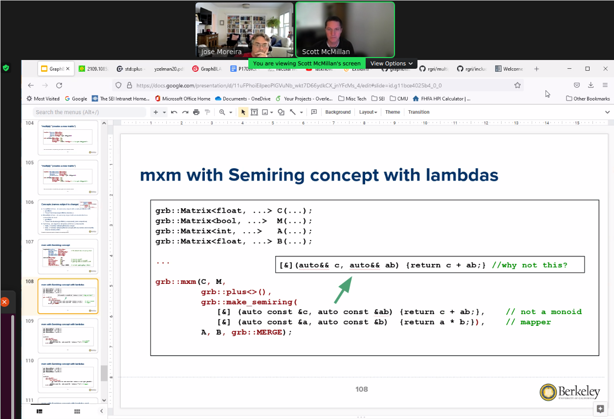

# GraphBLAS Languages Committee Meeting (on C++ API) - May 10, 2022

## Attendees
- [X] Ben Brock
- [X] Scott McMillan
- [X] Tim Mattson
- [X] Aydin Buluc
- [X] Jose Moreira

## Agenda
Discuss Jose Moreira's categorization of "sparse BLAS" and "semiring BLAS"

## Minutes

- Jose asserted that `ewiseAdd` and `ewiseMult` should not accept monoids or binary ops, as they lose their semantic meaning without a semiring.
- Instead, `ewiseUnion` and `ewiseIntersection` could accept binary ops, as well-defined set operations.

- Tim asserted that keeping an implied zero is a "longstanding practice in sparse linear algebra" that greatly simplifies things.
- The only reason `ewiseAdd` and `ewiseMult` make sense is because they correspond to that implied zero.

- Ben suggested the creation of a third `ewise` operation, which would require placeholder (possibly "identity" values) for both matrices.  This could be used to perform a subtraction (which is currently difficult in GrphBLAS).

- Scott presented slides on matrix multiply, comparing lambda syntax with and without semirings.  Using a semiring requires adding a `make_semiring` clause in `mxm`, versus having multiple arguments.

- Scott suggests requiring the semiring just adds bulkiness to the call, which is inelegant.

