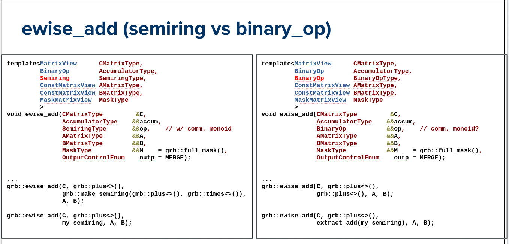

# GraphBLAS Languages Committee Meeting (on C++ API) - May 10, 2022

## Attendees
- [X] Ben Brock
- [X] Scott McMillan
- [ ] Tim Mattson
- [ ] Aydin Buluc
- [X] Jose Moreira

## Agenda
Discuss 

## Minutes

- Discussed the possibility of doing a half-day tutorial at PACT.  This would
  be interactive and focus on the C++ API.

- Scott presented slides on `ewise_add` for binary op and semiring.  He proposed that the only real difference
  between the semiring and binary op versions is the type of the user-provided op.
  Using a semiring only makes things more bloated.

- Jose stated that `ewise_add` is not meaningful outside of the context of a
  "semiring BLAS," and that element-wise operations that operate using binary
  ops should be considered as belonging to a "sparse BLAS" and kept separate
  from "semiring BLAS" operations.

- Ben and Scott then characterized today's debate as being about three central
  questions:

1. Does it make sense to call `ewise_add` without using a semiring (or monoid)?
   Consensus (3/3): No.  "Add" only makes sense because an identity is known,
   thus allowing a semantic add to take place.  Allowing binary ops results in
   meaningless operations, such as `ewise_add` called with the `minus` op.  This
   is allowed (and well-defined) in the C API, but is considered unfortunate.

2. Should semirings then exist at all in the API, if I can do everything using
   a monoid (or a binary op with a hypothetical `ewise_union`)?
   Mixed (2/3 yes, 1/3 undecided)

3. Should there be some way to perform an element-wise subtraction in the API?
   For example, a version of `ewise` that allows providing lefthand and righthand
   placeholders to be used when no value exists?
   Consensus (3/3): Probably.
